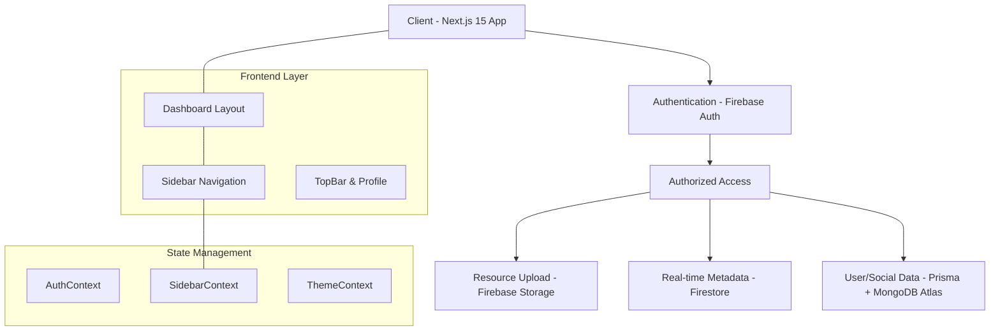
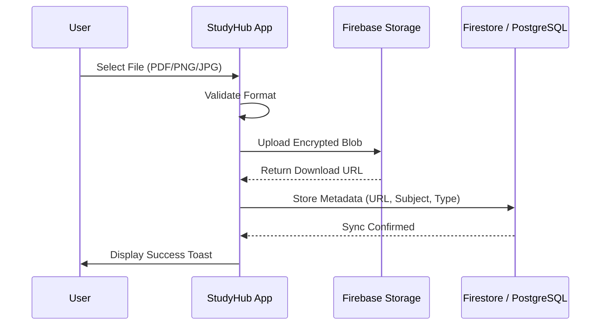

# 🎓 StudyHub: The Ultimate Academic Resource Vault

[](https://studyhuby.vercel.app)
[](https://nextjs.org)
[](https://firebase.google.com)
[](https://prisma.io)
[](https://mongodb.com)

StudyHub is a premium, state-of-the-art academic platform designed to streamline the sharing and discovery of educational resources. Built with a sleek, high-contrast aesthetic, it offers a hybrid infrastructure (MongoDB + Firestore) for a seamless experience in managing notes, papers, and exam materials.

---

## 🌟 Key Features

### 📁 Resource Management
- **Study Materials**: Share and discover notes, manuals, and documents (PDF, PNG, JPG).
- **Question Papers**: Access previous year exams categorized by **Regular**, **Makeup**, and **Reexam**.
- **Research Papers**: A dedicated vault for academic publications with abstract previews.
- **Model Papers**: Practice with curated model question sets without difficulty distractions.

### 🌓 Premium Experience
- **Adaptive Theme**: Seamless toggle between sleek **Dark Mode** (Black & Gold) and crisp **Light Mode**.
- **Collapsible Sidebar**: A flexible navigation system that collapses to icon-only mode for maximum focus.
- **Glassmorphism UI**: Modern, translucent design elements that feel extremely premium.

### 👤 Social & Engagement
- **Follower System**: Follow your peers and build a network of academic contributors.
- **Real-time Storage Vault**: A centralized hub in **Settings** to manage all your uploads with live file counts and direct deletion across 4 resource categories.
- **Usage Metrics**: Interactive storage indicator with quota tracking (**500MB Limit**) and real-time occupied space calculations.
- **Login Streaks**: Keep your study momentum alive with a gamified streak system.

---

## 🏗️ Architecture & Flow

### System Block Diagram



### Data Flow for Resource Upload



---

## 🛠️ Tech Stack

- **Core**: [Next.js 16+](https://nextjs.org) (App Router), [React 19](https://react.dev)
- **Styling**: Vanilla CSS, [Framer Motion](https://framer.com/motion), [Lucide React Icons](https://lucide.dev)
- **Database/ORM**: [Prisma 6+](https://prisma.io), [MongoDB Atlas](https://mongodb.com)
- **State/Real-time**: [Google Firebase](https://firebase.google.com) (Auth, Firestore, Storage)
- **Persistence**: Vercel

---

## 🚀 Getting Started

### Prerequisites

- [Node.js 18+](https://nodejs.org)
- [Firebase Account & Config](https://console.firebase.google.com)
- [MongoDB Atlas Connection URI](https://mongodb.com) (Check `.env.example`)

### Installation

1.  **Clone the Repository**:
    ```bash
    git clone https://github.com/username/studyhub.git
    cd studyhub
    ```

2.  **Install Dependencies**:
    ```bash
    npm install
    ```

3.  **Setup Environment Variables**:
    Create a `.env` file in the root directory:
    ```bash
    DATABASE_URL="your_postgresql_url"
    NEXT_PUBLIC_FIREBASE_API_KEY="..."
    # ... other firebase keys
    ```

4.  **Generate Prisma Client**:
    ```bash
    npx prisma generate
    ```

5.  **Run Development Server**:
    ```bash
    npm run dev
    ```

---

## 📄 License

This project is licensed under the [MIT License](LICENSE).

---

<p align="center">
  Built with ❤️ by the StudyHub Team
</p>
