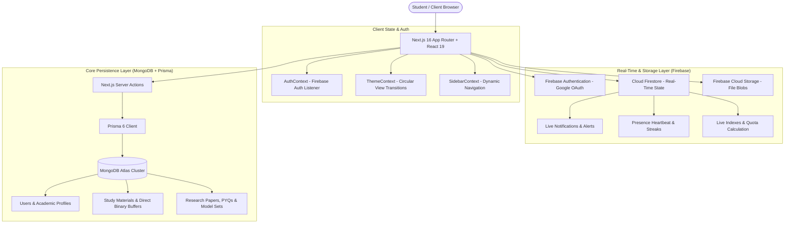
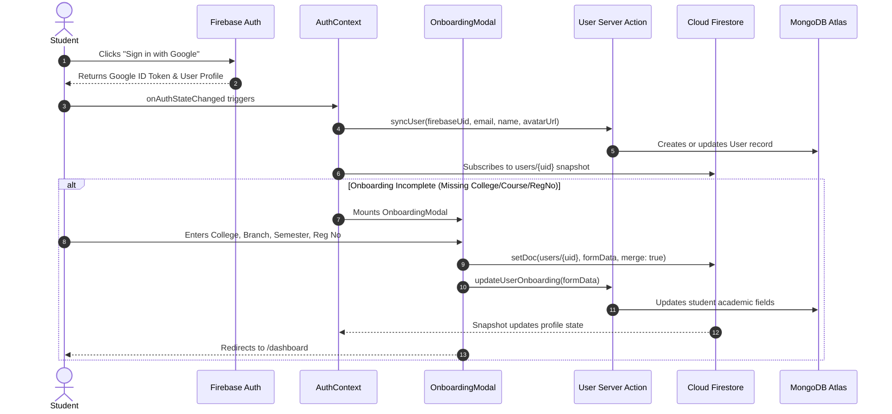
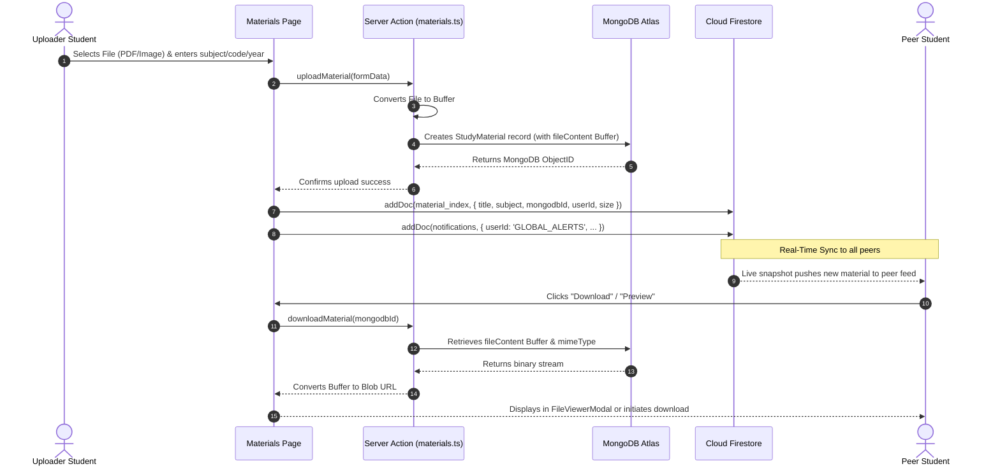
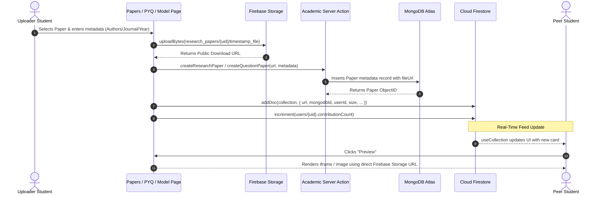
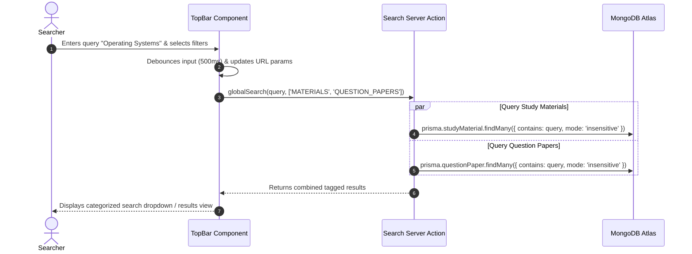
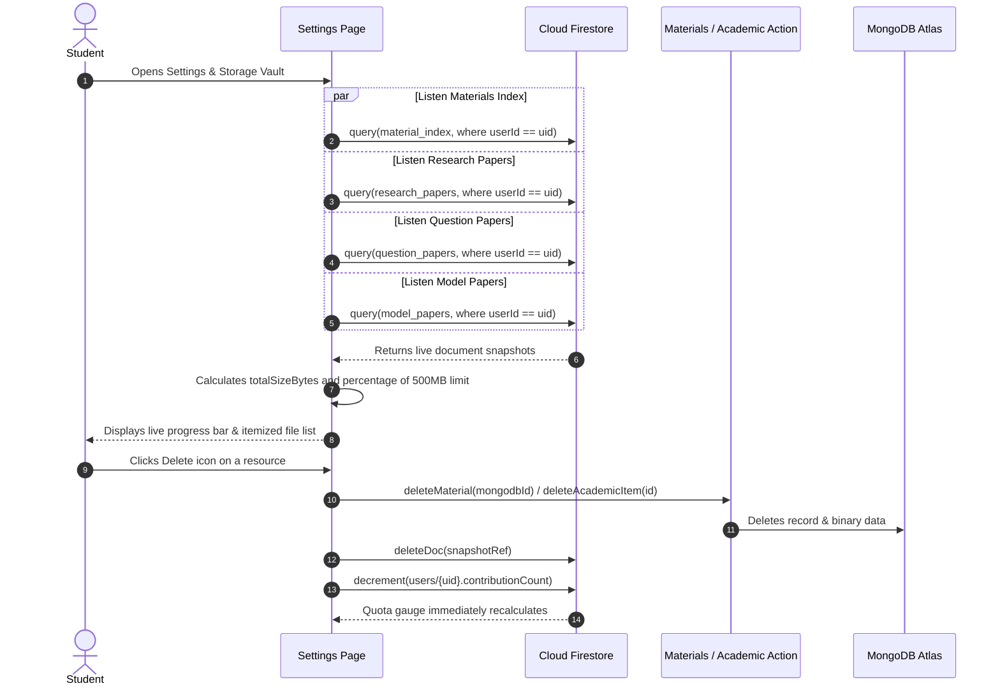
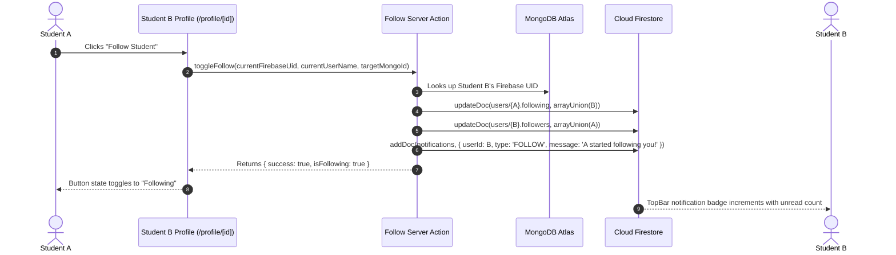

# 🎓 StudyHub: The Ultimate Academic Resource Vault

[](https://nextjs.org)
[](https://react.dev)
[](https://firebase.google.com)
[](https://prisma.io)
[](https://mongodb.com)
[](https://tailwindcss.com)

**StudyHub** is a state-of-the-art academic platform engineered for students, educators, and researchers to seamlessly publish, discover, and collaborate on educational resources. Built with a **hybrid data infrastructure** (MongoDB Atlas + Google Cloud Firebase) and designed with an obsidian-and-gold aesthetic, StudyHub provides high-performance file management, live search, peer networking, and real-time storage quota tracking.

---

## 📑 Table of Contents

1. [Architectural Overview](#-architectural-overview)
2. [Key Features & Capabilities](#-key-features--capabilities)
3. [End-to-End Workflows & Data Flows](#-end-to-end-workflows--data-flows)
   - [1. Authentication, Profile Sync & Onboarding](#1-authentication-profile-sync--onboarding-workflow)
   - [2. Study Materials Binary Storage Flow](#2-study-materials-binary-storage--retrieval-workflow)
   - [3. Academic & Exam Papers Cloud Streaming Flow](#3-academic--exam-papers-cloud-streaming-workflow)
   - [4. Universal Multi-Category Global Search](#4-universal-multi-category-global-search-workflow)
   - [5. Storage Vault & Live Quota Management](#5-storage-vault--live-quota-management-workflow)
   - [6. Social Peer Follow & Real-Time Notifications](#6-social-peer-follow--notification-workflow)
4. [Database & Data Models](#-database--data-models)
5. [Directory & File Structure](#-directory--file-structure)
6. [Prerequisites & Environment Variables](#-prerequisites--environment-variables)
7. [Installation & Local Setup](#-installation--local-setup)
8. [Firebase Security & Storage Rules](#-firebase-security--storage-rules)
9. [Project Visionary & Contributors](#-project-visionary--contributors)

---

## 🏛️ Architectural Overview

StudyHub leverages a **Hybrid Cloud Data Architecture**:


```mermaid
graph TD
    User([Student / Client Browser]) --> App[Next.js 16 App Router + React 19]

    subgraph "Client State & Auth"
        App --> AuthCtx[AuthContext - Firebase Auth Listener]
        App --> ThemeCtx[ThemeContext - Circular View Transitions]
        App --> SideCtx[SidebarContext - Dynamic Navigation]
    end

    subgraph "Real-Time & Storage Layer (Firebase)"
        App --> FBAuth[Firebase Authentication - Google OAuth]
        App --> FStore[Cloud Firestore - Real-Time State]
        App --> FBStore[Firebase Cloud Storage - File Blobs]
        FStore --> Notifs[Live Notifications & Alerts]
        FStore --> Presence[Presence Heartbeat & Streaks]
        FStore --> Index[Live Indexes & Quota Calculation]
    end

    subgraph "Core Persistence Layer (MongoDB + Prisma)"
        App --> ServerActions[Next.js Server Actions]
        ServerActions --> Prisma[Prisma 6 Client]
        Prisma --> MongoDB[(MongoDB Atlas Cluster)]
        MongoDB --> MongoUsers[Users & Academic Profiles]
        MongoDB --> MongoMaterials[Study Materials & Direct Binary Buffers]
        MongoDB --> MongoPapers[Research Papers, PYQs & Model Sets]
    end
```

---

## 🌟 Key Features & Capabilities

### 1. 📁 4-Tier Academic Resource System
* **Study Materials (`/dashboard/materials`)**: Lecture notes, handwritten summaries, and lab manuals. Stored as direct binary buffers in MongoDB for fast retrieval and streaming.
* **Research Papers (`/dashboard/papers`)**: Academic publications with author lists, abstract previews, journal citations, and DOI links stored in Firebase Storage.
* **Question Papers / PYQs (`/dashboard/question-papers`)**: Past exam papers categorized by semester, branch, college, year, and examination type (**Regular**, **Makeup**, **Re-exam**).
* **Model Question Sets (`/dashboard/model-papers`)**: Practice and mock question sets for exam preparation.

### 2. 🔍 Universal Multi-Category Global Search
* TopBar search with interactive category toggles (`MATERIALS`, `QUESTION_PAPERS`, `MODEL_PAPERS`, `RESEARCH_PAPERS`, `ACCOUNTS`).
* Debounced query processing with case-insensitive matching across MongoDB and Firestore.

### 3. 🖥️ In-App Document Viewer (`FileViewerModal`)
* Embedded preview for **PDFs** and **Images (PNG, JPG, JPEG, WebP)** without external tools.
* Live download triggers with automatic statistic tracking (downloads counter increments).

### 4. 💾 Storage Vault & Live 500MB Quota Tracking (`/dashboard/settings`)
* Real-time calculation of total occupied bytes across all 4 categories.
* Interactive quota bar with percentage indicator.
* One-click direct deletion with cross-database cascade cleanup.

### 5. 👥 Social Network & Follower System (`/dashboard/profile/[id]` & `/dashboard/network`)
* Follow and unfollow peer students with live notification badges.
* Public profile showcasing student university details, major, and uploaded resource timeline.

### 6. 🔥 Gamified Login Streaks & Presence Heartbeat
* Automated daily streak increment calculation in `AuthContext`.
* Background presence heartbeat pinging Firestore every 2 minutes.

### 7. 🎨 Obsidian & Gold Design System
* High-contrast Dark Mode (`#000000` with `#d4af37` gold highlights) and crisp Light Mode.
* Smooth circular ripple animations powered by the modern **View Transition API**.
* Glassmorphism, subtle micro-animations, and fluid layout scaling.

---

## 🔄 End-to-End Workflows & Data Flows

### 1. Authentication, Profile Sync & Onboarding Workflow


```mermaid
sequenceDiagram
    autonumber
    actor User as Student
    participant Auth as Firebase Auth
    participant Context as AuthContext
    participant Modal as OnboardingModal
    participant Action as User Server Action
    participant Firestore as Cloud Firestore
    participant Mongo as MongoDB Atlas

    User->>Auth: Clicks "Sign in with Google"
    Auth-->>User: Returns Google ID Token & User Profile
    User->>Context: onAuthStateChanged triggers
    Context->>Action: syncUser(firebaseUid, email, name, avatarUrl)
    Action->>Mongo: Creates or updates User record
    Context->>Firestore: Subscribes to users/{uid} snapshot
    alt Onboarding Incomplete (Missing College/Course/RegNo)
        Context->>Modal: Mounts OnboardingModal
        User->>Modal: Enters College, Branch, Semester, Reg No
        Modal->>Firestore: setDoc(users/{uid}, formData, merge: true)
        Modal->>Action: updateUserOnboarding(formData)
        Action->>Mongo: Updates student academic fields
        Firestore-->>Context: Snapshot updates profile state
        Modal-->>User: Redirects to /dashboard
    end
```

---

### 2. Study Materials Binary Storage & Retrieval Workflow


```mermaid
sequenceDiagram
    autonumber
    actor Uploader as Uploader Student
    participant App as Materials Page
    participant Server as Server Action (materials.ts)
    participant Mongo as MongoDB Atlas
    participant Firestore as Cloud Firestore
    actor Peer as Peer Student

    Uploader->>App: Selects File (PDF/Image) & enters subject/code/year
    App->>Server: uploadMaterial(formData)
    Server->>Server: Converts File to Buffer
    Server->>Mongo: Creates StudyMaterial record (with fileContent Buffer)
    Mongo-->>Server: Returns MongoDB ObjectID
    Server-->>App: Confirms upload success
    App->>Firestore: addDoc(material_index, { title, subject, mongodbId, userId, size })
    App->>Firestore: addDoc(notifications, { userId: 'GLOBAL_ALERTS', ... })
    
    note over Firestore,Peer: Real-Time Sync to all peers
    Firestore-->>Peer: Live snapshot pushes new material to peer feed
    Peer->>App: Clicks "Download" / "Preview"
    App->>Server: downloadMaterial(mongodbId)
    Server->>Mongo: Retrieves fileContent Buffer & mimeType
    Mongo-->>Server: Returns binary stream
    Server-->>App: Converts Buffer to Blob URL
    App-->>Peer: Displays in FileViewerModal or initiates download
```

---

### 3. Academic & Exam Papers Cloud Streaming Workflow


```mermaid
sequenceDiagram
    autonumber
    actor Uploader as Uploader Student
    participant App as Papers / PYQ / Model Page
    participant Storage as Firebase Storage
    participant Server as Academic Server Action
    participant Mongo as MongoDB Atlas
    participant Firestore as Cloud Firestore
    actor Peer as Peer Student

    Uploader->>App: Selects Paper & enters metadata (Authors/Journal/Year)
    App->>Storage: uploadBytes(research_papers/{uid}/timestamp_file)
    Storage-->>App: Returns Public Download URL
    App->>Server: createResearchPaper / createQuestionPaper(url, metadata)
    Server->>Mongo: Inserts Paper metadata record with fileUrl
    Mongo-->>Server: Returns Paper ObjectID
    App->>Firestore: addDoc(collection, { url, mongodbId, userId, size, ... })
    App->>Firestore: increment(users/{uid}.contributionCount)
    
    note over Firestore,Peer: Real-Time Feed Update
    Firestore-->>Peer: useCollection updates UI with new card
    Peer->>App: Clicks "Preview"
    App-->>Peer: Renders iframe / image using direct Firebase Storage URL
```

---

### 4. Universal Multi-Category Global Search Workflow


```mermaid
sequenceDiagram
    autonumber
    actor User as Searcher
    participant TopBar as TopBar Component
    participant Server as Search Server Action
    participant Mongo as MongoDB Atlas

    User->>TopBar: Enters query "Operating Systems" & selects filters
    TopBar->>TopBar: Debounces input (500ms) & updates URL params
    TopBar->>Server: globalSearch(query, ['MATERIALS', 'QUESTION_PAPERS'])
    par Query Study Materials
        Server->>Mongo: prisma.studyMaterial.findMany({ contains: query, mode: 'insensitive' })
    and Query Question Papers
        Server->>Mongo: prisma.questionPaper.findMany({ contains: query, mode: 'insensitive' })
    end
    Server-->>TopBar: Returns combined tagged results
    TopBar-->>User: Displays categorized search dropdown / results view
```

---

### 5. Storage Vault & Live Quota Management Workflow


```mermaid
sequenceDiagram
    autonumber
    actor User as Student
    participant Settings as Settings Page
    participant Firestore as Cloud Firestore
    participant Server as Materials / Academic Action
    participant Mongo as MongoDB Atlas

    User->>Settings: Opens Settings & Storage Vault
    par Listen Materials Index
        Settings->>Firestore: query(material_index, where userId == uid)
    and Listen Research Papers
        Settings->>Firestore: query(research_papers, where userId == uid)
    and Listen Question Papers
        Settings->>Firestore: query(question_papers, where userId == uid)
    and Listen Model Papers
        Settings->>Firestore: query(model_papers, where userId == uid)
    end
    Firestore-->>Settings: Returns live document snapshots
    Settings->>Settings: Calculates totalSizeBytes and percentage of 500MB limit
    Settings-->>User: Displays live progress bar & itemized file list
    
    User->>Settings: Clicks Delete icon on a resource
    Settings->>Server: deleteMaterial(mongodbId) / deleteAcademicItem(id)
    Server->>Mongo: Deletes record & binary data
    Settings->>Firestore: deleteDoc(snapshotRef)
    Settings->>Firestore: decrement(users/{uid}.contributionCount)
    Firestore-->>Settings: Quota gauge immediately recalculates
```

---

### 6. Social Peer Follow & Notification Workflow


```mermaid
sequenceDiagram
    autonumber
    actor Follower as Student A
    participant Profile as Student B Profile (/profile/[id])
    participant Action as Follow Server Action
    participant Mongo as MongoDB Atlas
    participant Firestore as Cloud Firestore
    actor Target as Student B

    Follower->>Profile: Clicks "Follow Student"
    Profile->>Action: toggleFollow(currentFirebaseUid, currentUserName, targetMongoId)
    Action->>Mongo: Looks up Student B's Firebase UID
    Action->>Firestore: updateDoc(users/{A}.following, arrayUnion(B))
    Action->>Firestore: updateDoc(users/{B}.followers, arrayUnion(A))
    Action->>Firestore: addDoc(notifications, { userId: B, type: 'FOLLOW', message: 'A started following you!' })
    Action-->>Profile: Returns { success: true, isFollowing: true }
    Profile-->>Follower: Button state toggles to "Following"
    Firestore-->>Target: TopBar notification badge increments with unread count
```

---

## 🗄️ Database & Data Models

### Prisma Schema (`prisma/schema.prisma`)

```prisma
datasource db {
  provider = "mongodb"
  url      = env("DATABASE_URL")
}

generator client {
  provider   = "prisma-client-js"
  engineType = "library"
}

enum Role {
  USER
  ADMIN
}

model User {
  id             String   @id @default(auto()) @map("_id") @db.ObjectId
  firebaseUid    String   @unique
  email          String   @unique
  name           String?
  avatarUrl      String?
  role           Role     @default(USER)

  // Academic Onboarding
  college        String?
  course         String?
  semester       Int?
  academicYear   String?
  registrationNo String?

  // Streaks & Activity
  lastLoginAt    DateTime @default(now())
  loginStreak    Int      @default(0)

  studyMaterials StudyMaterial[]
  researchPapers ResearchPaper[]
  questionPapers QuestionPaper[]
  modelPapers    ModelPaper[]

  createdAt      DateTime @default(now())
  updatedAt      DateTime @updatedAt
}

model StudyMaterial {
  id          String   @id @default(auto()) @map("_id") @db.ObjectId
  userId      String   @db.ObjectId
  user        User     @relation(fields: [userId], references: [id], onDelete: Cascade)

  title       String
  subject     String
  subjectCode String
  year        Int
  branch      String
  college     String
  description String?
  fileUrl     String?
  fileContent Bytes?   // Direct binary document buffer in MongoDB
  fileSize    Int
  mimeType    String
  tags        String[]

  createdAt   DateTime @default(now())
  updatedAt   DateTime @updatedAt
}

model ResearchPaper {
  id              String   @id @default(auto()) @map("_id") @db.ObjectId
  userId          String   @db.ObjectId
  user            User     @relation(fields: [userId], references: [id], onDelete: Cascade)

  title           String
  authors         String[]
  abstract        String
  publicationYear Int
  journal         String?
  doi             String?
  fileUrl         String
  tags            String[]

  createdAt       DateTime @default(now())
  updatedAt       DateTime @updatedAt
}

model QuestionPaper {
  id          String   @id @default(auto()) @map("_id") @db.ObjectId
  userId      String   @db.ObjectId
  user        User     @relation(fields: [userId], references: [id], onDelete: Cascade)

  subject     String
  subjectCode String
  year        Int
  semester    Int
  branch      String
  college     String
  session     String?
  fileUrl     String
  tags        String[]

  createdAt   DateTime @default(now())
  updatedAt   DateTime @updatedAt
}

model ModelPaper {
  id          String   @id @default(auto()) @map("_id") @db.ObjectId
  userId      String   @db.ObjectId
  user        User     @relation(fields: [userId], references: [id], onDelete: Cascade)

  subject     String
  subjectCode String
  year        Int
  semester    Int
  branch      String
  college     String
  session     String?
  fileUrl     String
  tags        String[]

  createdAt   DateTime @default(now())
  updatedAt   DateTime @updatedAt
}
```

---

## 📂 Directory & File Structure

```
StudyHuby/
├── README.md                          # Root Documentation
└── studyhub/
    ├── prisma/
    │   └── schema.prisma              # MongoDB Prisma Schema definition
    ├── public/
    │   └── anish-avatar.png           # 3D Project Visionary asset
    ├── src/
    │   ├── app/
    │   │   ├── layout.tsx             # Root layout with ThemeProvider & AuthProvider
    │   │   ├── page.tsx               # Landing page with hero & Visionary showcase
    │   │   ├── globals.css            # Tailwind CSS v4, obsidian/gold palette & View Transitions
    │   │   ├── actions/               # Next.js Server Actions
    │   │   │   ├── academic.ts        # CRUD for Research, Question & Model papers
    │   │   │   ├── materials.ts       # Upload, query, binary download & delete for Study Materials
    │   │   │   ├── user.ts            # User sync, onboarding updates, search & metrics
    │   │   │   ├── follow.ts          # Follow/unfollow logic & notifications
    │   │   │   └── search.ts          # Multi-category global search
    │   │   └── dashboard/
    │   │       ├── layout.tsx         # Dashboard frame with Sidebar & TopBar
    │   │       ├── page.tsx           # Main overview with live metrics & quick actions
    │   │       ├── materials/         # Study Materials vault (notes & manuals)
    │   │       ├── papers/            # Research Paper directory
    │   │       ├── question-papers/   # Exam PYQ archives (Regular, Makeup, Re-exam)
    │   │       ├── model-papers/      # Model exam question sets
    │   │       ├── profile/[id]/      # Student public profiles & contribution timelines
    │   │       ├── network/           # Student directory & peer discovery
    │   │       ├── vault/             # Personal uploaded resources vault
    │   │       └── settings/          # Storage quota gauge & profile management
    │   ├── components/
    │   │   ├── ContributorsBox.tsx    # Project visionary showcase (Anish Tanaji Inamadar)
    │   │   ├── FileViewerModal.tsx    # In-app document previewer (PDFs & Images)
    │   │   ├── ThemeProvider.tsx      # Dark/Light theme provider
    │   │   ├── auth/
    │   │   │   └── OnboardingModal.tsx # Student university onboarding flow
    │   │   └── layout/
    │   │       ├── Sidebar.tsx        # Collapsible sidebar with daily streak tracker
    │   │       └── TopBar.tsx         # Universal search, category filters & notification bell
    │   ├── context/
    │   │   ├── AuthContext.tsx        # Firebase auth listener, auto-sync & presence heartbeat
    │   │   └── SidebarContext.tsx     # Responsive sidebar collapse state
    │   └── lib/
    │       ├── firebase.ts            # Firebase Web SDK initialization
    │       └── prisma.ts              # Global singleton Prisma client
    ├── package.json
    ├── tsconfig.json
    └── next.config.ts
```

---

## ⚙️ Prerequisites & Environment Variables

### Prerequisites
* **Node.js**: `v18.18.0` or higher (Node 20+ recommended)
* **MongoDB Atlas**: A running MongoDB cluster connection string
* **Google Firebase Project**: Enabled with **Authentication** (Google Provider), **Cloud Firestore**, and **Firebase Storage**

### `.env` Configuration
Create a `.env` file in the `studyhub` directory (`studyhub/.env`):

```env
# MongoDB Connection String (Prisma)
DATABASE_URL="mongodb+srv://<username>:<password>@<cluster>.mongodb.net/studyhub?retryWrites=true&w=majority"

# Firebase Public Configuration
NEXT_PUBLIC_FIREBASE_API_KEY="AIzaSy..."
NEXT_PUBLIC_FIREBASE_AUTH_DOMAIN="your-project.firebaseapp.com"
NEXT_PUBLIC_FIREBASE_PROJECT_ID="your-project-id"
NEXT_PUBLIC_FIREBASE_STORAGE_BUCKET="your-project.firebasestorage.app"
NEXT_PUBLIC_FIREBASE_MESSAGING_SENDER_ID="123456789"
NEXT_PUBLIC_FIREBASE_APP_ID="1:123456789:web:abcdef"
NEXT_PUBLIC_FIREBASE_MEASUREMENT_ID="G-XXXXXX"
```

---

## 🚀 Installation & Local Setup

1. **Clone the Repository**:
   ```bash
   git clone https://github.com/IKnowU27735300/StudyHuby.git
   cd StudyHuby/studyhub
   ```

2. **Install Dependencies**:
   ```bash
   npm install
   ```

3. **Generate Prisma Client**:
   ```bash
   npx prisma generate
   ```

4. **Start the Development Server**:
   ```bash
   npm run dev
   ```
   Open [http://localhost:3000](http://localhost:3000) (or `http://localhost:3001` if port 3000 is occupied).

---

## 🔒 Firebase Security & Storage Rules

To allow authenticated students to share, search, and download files, apply the following rules in your [Firebase Console](https://console.firebase.google.com/):

### 1. Cloud Firestore Rules
*(Firebase Console > Firestore Database > Rules)*

```javascript
rules_version = '2';

service cloud.firestore {
  match /databases/{database}/documents {
    
    // User profile documents
    match /users/{userId} {
      allow read, write: if request.auth != null;
    }
    
    // Notifications & broadcast alerts
    match /notifications/{notificationId} {
      allow read, write: if request.auth != null;
    }

    // Real-time material and paper index collections
    match /material_index/{docId} {
      allow read, write: if request.auth != null;
    }
    match /research_papers/{docId} {
      allow read, write: if request.auth != null;
    }
    match /question_papers/{docId} {
      allow read, write: if request.auth != null;
    }
    match /model_papers/{docId} {
      allow read, write: if request.auth != null;
    }

    // Default authenticated access
    match /{document=**} {
      allow read, write: if request.auth != null;
    }
  }
}
```

### 2. Firebase Cloud Storage Rules
*(Firebase Console > Storage > Rules)*

```javascript
rules_version = '2';

service firebase.storage {
  match /b/{bucket}/o {
    match /{allPaths=**} {
      allow read, write: if request.auth != null;
    }
  }
}
```

---

## 👤 Project Visionary & Contributors

<div align="center">
  
  <h3>Anish Tanaji Inamadar</h3>
  <p><b>Project Visionary & Systems Architect</b></p>
  <p>
    <a href="mailto:anishinamadar11111@gmail.com">Email</a> •
    <a href="https://github.com/IKnowU27735300" target="_blank">GitHub</a> •
    <a href="https://www.linkedin.com/in/anish-inamadar-858461303" target="_blank">LinkedIn</a> •
    <a href="https://resume-nu-red-78.vercel.app/" target="_blank">Portfolio</a>
  </p>
</div>

---

## 📄 License

This project is open source and available under the **[MIT License](LICENSE)**.

<p align="center">
  Built with ❤️ for learners worldwide by the StudyHub Team.
</p>
