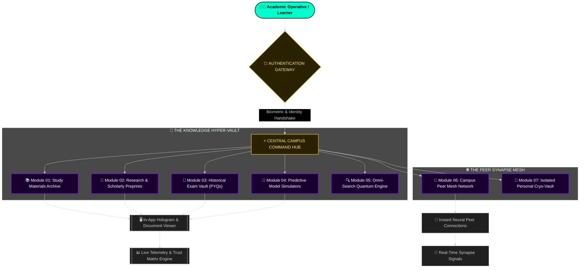
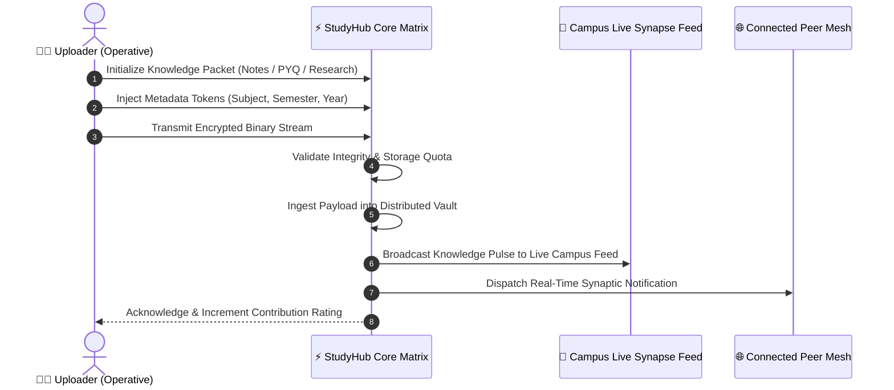
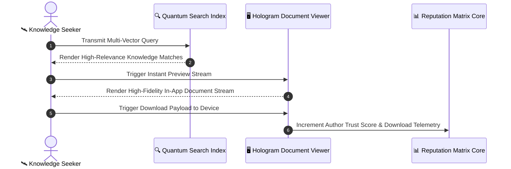
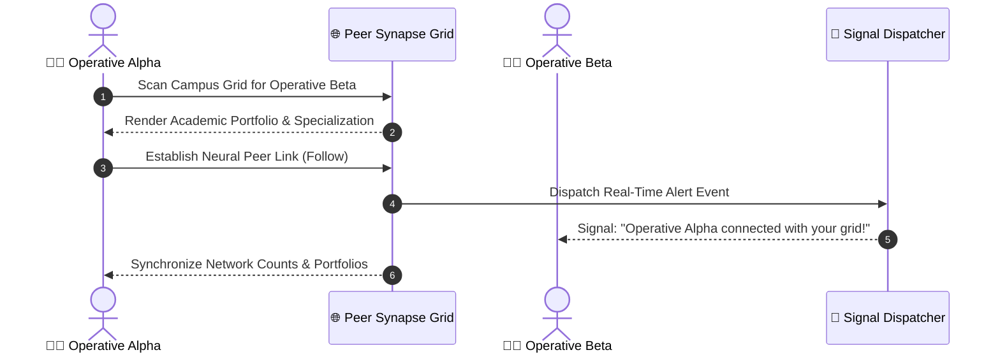

<div align="center">

```
   ███████╗████████╗██╗   ██╗██████╗ ██╗   ██╗██╗  ██╗██╗   ██╗██████╗ 
   ██╔════╝╚══██╔══╝██║   ██║██╔══██╗╚██╗ ██╔╝██║  ██║██║   ██║██╔══██╗
   ███████╗   ██║   ██║   ██║██║  ██║ ╚████╔╝ ███████║██║   ██║██████╔╝
   ╚════██║   ██║   ██║   ██║██║  ██║  ╚██╔╝  ██╔══██║██║   ██║██╔══██╗
   ███████║   ██║   ╚██████╔╝██████╔╝   ██║   ██║  ██║╚██████╔╝██████╔╝
   ╚══════╝   ╚═╝    ╚═════╝ ╚═════╝    ╚═╝   ╚═╝  ╚═╝ ╚═════╝ ╚═════╝ 
```

### 🌌 NEXT-GENERATION COLLABORATIVE ACADEMIC MATRIX
**The Sovereign Knowledge Vault & Decentralized Campus Intelligence Network**

[](https://studyhub.io)
[](https://studyhub.io)
[](https://studyhub.io)
[](https://studyhub.io)

---

> *"Transforming disconnected educational silos into a seamless, hyper-connected academic ecosystem where human intelligence converges and knowledge flows without friction."*

</div>

---

## ⚡ System Architecture Matrix


```mermaid
%%{init: {'theme': 'dark', 'themeVariables': { 'primaryColor': '#7928CA', 'edgeLabelBackground':'#000000', 'tertiaryColor': '#111111'}}}%%
flowchart TD
    User(["👨‍🚀 Academic Operative / Learner"]) --> Gateway{"⬡ AUTHENTICATION GATEWAY"}
    
    Gateway --> |Biometric & Identity Handshake| Hub["⚡ CENTRAL CAMPUS COMMAND HUB"]
    
    subgraph KNOWLEDGE_CHAMBER ["🌌 THE KNOWLEDGE HYPER-VAULT"]
        Hub --> N1["📚 Module 01: Study Materials Archive"]
        Hub --> N2["🔬 Module 02: Research & Scholarly Preprints"]
        Hub --> N3["📝 Module 03: Historical Exam Vault (PYQs)"]
        Hub --> N4["🎯 Module 04: Predictive Model Simulators"]
        Hub --> N5["🔍 Module 05: Omni-Search Quantum Engine"]
    end

    subgraph NETWORK_CHAMBER ["🌐 THE PEER SYNAPSE MESH"]
        Hub --> N6["👥 Module 06: Campus Peer Mesh Network"]
        Hub --> N7["💾 Module 07: Isolated Personal Cryo-Vault"]
    end

    N1 & N2 & N3 & N4 --> Viewer[["🖥️ In-App Hologram & Document Viewer"]]
    Viewer --> Telemetry[["📊 Live Telemetry & Trust Matrix Engine"]]
    
    N6 --> PeerLink["🔗 Instant Neural Peer Connections"]
    PeerLink --> QuantumAlerts["📡 Real-Time Synapse Signals"]

    classDef neon fill:#00ffcc,stroke:#003b30,stroke-width:2px,color:#000000,font-weight:bold;
    classDef cyber fill:#1a0033,stroke:#7928CA,stroke-width:2px,color:#ffffff;
    classDef gold fill:#2b2200,stroke:#d4af37,stroke-width:2px,color:#ffe885;
    
    class User neon;
    class Gateway,Hub gold;
    class N1,N2,N3,N4,N5,N6,N7 cyber;
```

---

## 💎 Core Knowledge Subsystems

### ⬡ 01. THE KNOWLEDGE REPOSITORY *(Study Materials)*
* **Objective:** High-density storage for handwritten lecture syntheses, laboratory manuals, and curated course modules.
* **Vector Categorization:** Automatically indexed by University Origin, Department, Semester, and Subject Code.
* **Direct Stream:** Instant document streaming without external software dependencies.

### ⬡ 02. SCHOLARLY DISCOVERY ENGINE *(Research Papers)*
* **Objective:** Open-access repository for student publications, scientific drafts, and peer-reviewed journals.
* **Telemetry Captured:** Abstract syntheses, co-author neural links, publication timelines, and DOI citation markers.
* **Deep Indexing:** High-speed keyword mapping across complex manuscripts and citations.

### ⬡ 03. CHRONO-EXAM VAULT *(Previous Year Papers)*
* **Objective:** Chronological archive of historical university examinations.
* **Temporal Tiers:**
  * **Temporal Filter:** Multi-year chronological archives for trend analysis.
  * **Exam Vector:** Dynamic classification (*Regular Session*, *Makeup Assessment*, *Re-evaluation*).
  * **Branch Code:** Direct lookup by university course protocols.

### ⬡ 04. PREDICTIVE REVISION MATRICES *(Model Papers)*
* **Objective:** Simulated test protocols, curated problem sets, and verified solution keys.
* **Rapid Deployment:** One-click instant extraction and inspection before examination deadlines.

### ⬡ 05. OMNI-SEARCH QUANTUM INDEX *(Global Search)*
* **Real-Time Cross-Corpus Querying:** Seamless multi-dimensional filtering across:
  * 📄 `Study Notes` • 📜 `Question Papers` • 🎯 `Model Sets` • 🔬 `Research Papers` • 👤 `Peer Operatives`
* **Zero-Latency Ingestion:** Live instant filtering responsive to individual keystrokes.

### ⬡ 06. THE PEER SYNAPSE MESH *(Campus Network)*
* **Sovereign Peer Portfolios:** Interactive student dossiers showcasing uploaded archives and campus standing.
* **Neural Peer Links:** Connect with campus operatives; receive instant notifications upon resource broadcast.
* **Discovery Radar:** Explore contributors across diverse university faculties and academic domains.

### ⬡ 07. ISOLATED CRYO-VAULT *(Personal File & Quota Center)*
* **Central Inventory:** Comprehensive telemetry panel listing every byte uploaded by the user.
* **Dynamic Capacity HUD:** Live storage meter tracking quota consumption in real time.
* **Atomic Cascade Wipe:** Single-click purge protocol that wipes metadata, indexes, and binary payloads simultaneously.

---

## 🧬 Operational Sequence Protocols

### 📡 Protocol Alpha: Knowledge Broadcast & Ingestion


```mermaid
sequenceDiagram
    autonumber
    actor Operative as 👨‍🚀 Uploader (Operative)
    participant Matrix as ⚡ StudyHub Core Matrix
    participant Feed as 📡 Campus Live Synapse Feed
    participant Peers as 🌐 Connected Peer Mesh

    Operative->>Matrix: Initialize Knowledge Packet (Notes / PYQ / Research)
    Operative->>Matrix: Inject Metadata Tokens (Subject, Semester, Year)
    Operative->>Matrix: Transmit Encrypted Binary Stream
    Matrix->>Matrix: Validate Integrity & Storage Quota
    Matrix->>Matrix: Ingest Payload into Distributed Vault
    Matrix->>Feed: Broadcast Knowledge Pulse to Live Campus Feed
    Matrix->>Peers: Dispatch Real-Time Synaptic Notification
    Matrix-->>Operative: Acknowledge & Increment Contribution Rating
```

---

### 🔍 Protocol Beta: Omni-Discovery & In-App Hologram Preview


```mermaid
sequenceDiagram
    autonumber
    actor Learner as 🛰️ Knowledge Seeker
    participant OmniSearch as 🔍 Quantum Search Index
    participant Viewer as 🖥️ Hologram Document Viewer
    participant TrustCore as 📊 Reputation Matrix Core

    Learner->>OmniSearch: Transmit Multi-Vector Query
    OmniSearch-->>Learner: Render High-Relevance Knowledge Matches
    Learner->>Viewer: Trigger Instant Preview Stream
    Viewer-->>Learner: Render High-Fidelity In-App Document Stream
    Learner->>Viewer: Trigger Download Payload to Device
    Viewer->>TrustCore: Increment Author Trust Score & Download Telemetry
```

---

### 🔗 Protocol Gamma: Peer Synchronization & Signal Dispatch


```mermaid
sequenceDiagram
    autonumber
    actor OperativeA as 🧑‍💻 Operative Alpha
    participant Synapse as 🌐 Peer Synapse Grid
    actor OperativeB as 🧑‍🔬 Operative Beta
    participant Pulse as 📡 Signal Dispatcher

    OperativeA->>Synapse: Scan Campus Grid for Operative Beta
    Synapse-->>OperativeA: Render Academic Portfolio & Specialization
    OperativeA->>Synapse: Establish Neural Peer Link (Follow)
    Synapse->>Pulse: Dispatch Real-Time Alert Event
    Pulse-->>OperativeB: Signal: "Operative Alpha connected with your grid!"
    Synapse-->>OperativeA: Synchronize Network Counts & Portfolios
```

---

## 🏆 Reputation Dynamics & Gamified HUD

```
 ┌────────────────────────────────────────────────────────────────────────┐
 │ 🔰 REPUTATION PROTOCOL                                                 │
 │ ├─ Trust Rating: Evaluates contributor authority via verified downloads│
 │ ├─ Reputation Tiers: Level 0 ➔ Level 5 Campus Luminary                 │
 │ └─ Integrity Rule: Rewards well-documented, clean educational archives │
 ├────────────────────────────────────────────────────────────────────────┤
 │ 🔥 STUDY CHRONO-STREAKS                                                │
 │ ├─ Temporal Engine: Monitors continuous 24-hour learning cycles        │
 │ ├─ HUD Display: Real-time streak ignition counter on the dashboard     │
 │ └─ Milestone Badges: Unlocks campus-wide visibility & recognition      │
 └────────────────────────────────────────────────────────────────────────┘
```

---

## 🛡️ Zero-Trust Security & Sovereign Integrity

| Security Vector | Implementation Mechanism | Protocol Guarantee |
| :--- | :--- | :--- |
| **Identity Verification** | Cryptographic Token Handshake | Zero unauthorized session hijacking |
| **Resource Provenance** | Immutable Contributor Signatures | Absolute attribution & copyright safety |
| **Cascade Liquidation** | Complete 4-Tier Cross-System Purge | Zero orphaned artifacts or storage leaks |
| **Privacy Enclaves** | Granular Private/Public Visibility | Student records remain sovereign & protected |

---

<div align="center">

```
   ✦ · · · · · · · · · · · · · · · · · · · · · · · · · · · · · · · · · · ✦
      DESIGNED FOR VISIONARY MINDS // POWERED BY COLLECTIVE INTELLIGENCE
   ✦ · · · · · · · · · · · · · · · · · · · · · · · · · · · · · · · · · · ✦
```

**[ 🚀 ENTER THE STUDYHUB MATRIX ]**

</div>
